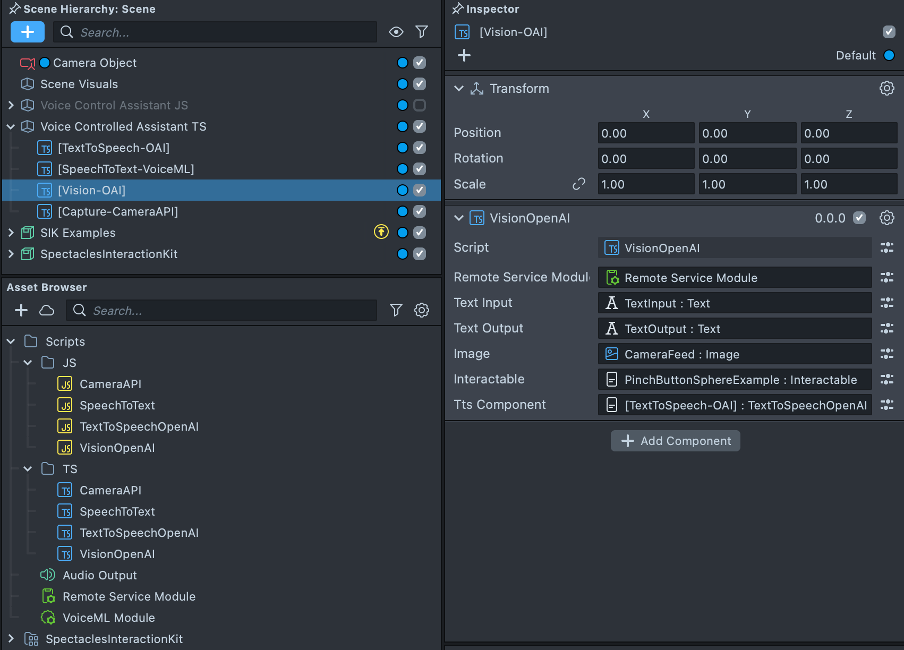
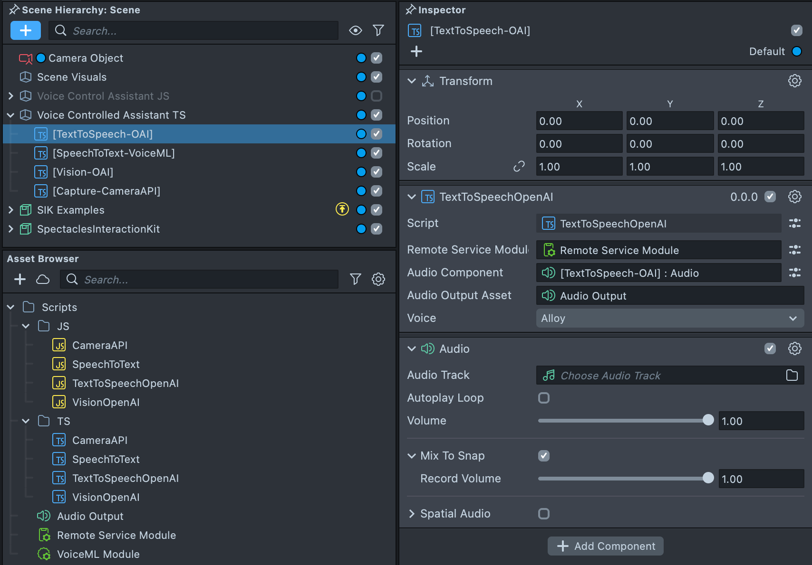
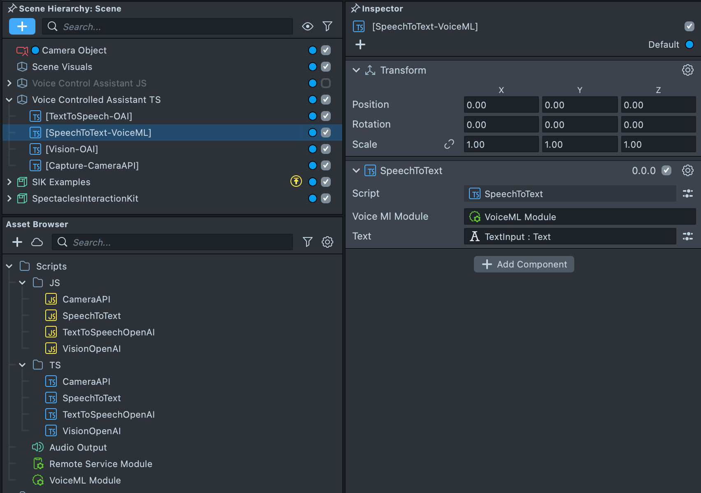
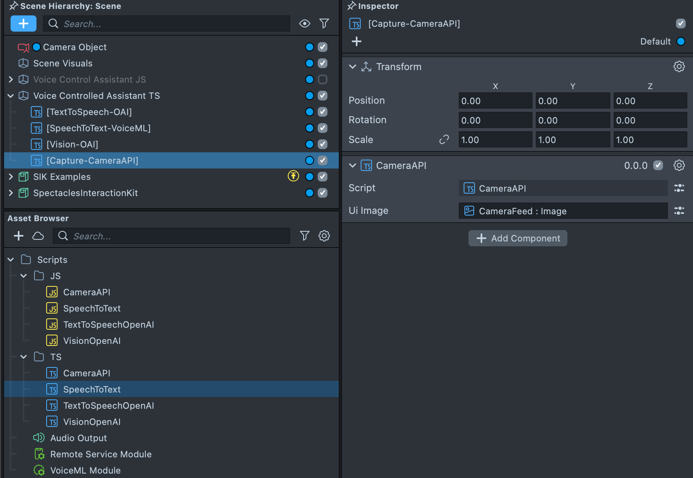

# AI Assistant

[](https://developers.snap.com/spectacles/about-spectacles-features/apis/experimental-apis?) [](https://developers.snap.com/spectacles/spectacles-frameworks/spectacles-interaction-kit/features/overview?) [](https://platform.openai.com/docs/guides/text-to-speech?) [](https://platform.openai.com/docs/guides/speech-to-text?) [](https://developers.snap.com/spectacles/about-spectacles-features/apis/camera-module?) [](https://developers.snap.com/spectacles/about-spectacles-features/compatability-list) [](https://platform.openai.com/docs/guides/text-generation?) [](https://platform.openai.com/docs/guides/vision?) [](https://developers.snap.com/spectacles/about-spectacles-features/apis/fetch?)


## Overview
This is a sample project that demonstrates an AI-powered vision assistance tool. The application uses [Spectacles ML Voice and Camera APIs](https://developers.snap.com/spectacles/about-spectacles-features/apis/camera-module) alongside OpenAI’s APIs for vision processing and text-to-speech capabilities.
The example is provided equally in Javascript and Typescript codebase.

> **NOTE:**
> This project will only work for the Spectacles platform.
> You must provide your own OpenAI API key to use the functionality provided by this project.

## Design Guidelines

Designing Lenses for Spectacles offers all-new possibilities to rethink user interaction with digital spaces and the physical world.
Get started using our [Design Guidelines](https://developers.snap.com/spectacles/best-practices/design-for-spectacles/introduction-to-spatial-design)

## Prerequisites

- **Lens Studio**: v5.4.0+
- **Spectacles OS Version**: v5.59.218+
- **Spectacles App iOS**: v0.59.1.1+
- **Spectacles App Android**: v0.59.1.1+

To update your Spectacles device and mobile app, please refer to this [guide](https://support.spectacles.com/hc/en-us/articles/30214953982740-Updating).

You can download the latest version of Lens Studio from [here](https://ar.snap.com/download?lang=en-US).

The camera feature requires you to use Experimental APIs. Please see Experimental APIs for more details [here](https://developers.snap.com/spectacles/about-spectacles-features/apis/experimental-apis).

Extended Permissions mode on device must be enabled for enabling some of the Spectacles APIs. Please see Extended Permissions for more details [here](https://developers.snap.com/spectacles/permission-privacy/extended-permissions).

## Getting Started

To obtain the project folder, clone the repository.

> **IMPORTANT:**
> This project uses Git Large Files Support (LFS). Downloading a zip file using the green button on GitHub **will not work**. You must clone the project with a version of git that has LFS.
> You can download Git LFS [here](https://git-lfs.github.com/).

## Initial Project Setup

The project should be pre-configured to get you started without any additional steps. However, ensure you:

1. Open `TextToSpeechOpenAI.js` and `VisionOpenAI.js` files.
2. Replace the placeholder API key with your own OpenAI API key:
   ```javascript
   const apiKey = "Insert your Open AI Key";
   ```

Failure to set your API key will result in errors when using the AI features.
If you are not familiar with Open AI development, get started at [Open AI API](https://openai.com/index/openai-api/).


## Key Features



### Vision Assistance

The application uses the camera to capture visual data, process it using OpenAI’s Vision API, and provide users with relevant information in real-time. This feature is powered by the `VisionOpenAI.js` script.

See more at [Open AI Vision](https://platform.openai.com/docs/guides/vision)



### Text-to-Speech

Leveraging OpenAI’s Text-to-Speech API, the application converts textual information into audio output for seamless user interaction. This feature is handled by the `TextToSpeechOpenAI.js` script.
Remember to check "Mix To Snap" if you wish to record the Assistant voice in your recordings.

See more at [Open AI TTS](https://platform.openai.com/docs/models#tts)



### Speech-to-Text

Leveraging [VoiceML](https://developers.snap.com/lens-studio/features/audio/speech-recognition). This feature is handled by the `CameraAPI.js` script.



### Camera Access

Leveraging [Snap Camera API](https://developers.snap.com/spectacles/about-spectacles-features/apis/camera-module). This feature is handled by the `SpeechToText.js` script.

### Change System Prompt

You can change the personality of the AI Assistant in `VisionOpenAI.js` script.

```javascript
const requestPayload = {
  model: "gpt-4o-mini",
  messages: [
    {
      role: "system",
      content:
        "You are a helpful AI assistant that works for Snapchat that has access to the view that the user is looking at using Augmented Reality Glasses." +
        " The user is asking for help with the following image and text. Keep it short like under 30 words. Be a little funny and keep it positive.",
    },
    {
      role: "user",
      content: [
        { type: "text", text: script.textInput.text },
        {
          type: "image_url",
          image_url: {
            url: `data:image/jpeg;base64,${base64Image}`,
          },
        },
      ],
    },
  ],
};
```

### Change Image Understanding Budget

You can change the personality of the AI Assistant in `VisionOpenAI.js` script.

```javascript
function encodeTextureToBase64(texture) {
    return new Promise((resolve, reject) => {
        Base64.encodeTextureAsync(
            texture,
            resolve,
            reject,
            CompressionQuality.LowQuality,
            EncodingType.Jpg
        );
    });
```

## Key Scripts

### VisionOpenAI.js

This script handles:

- Capturing input from the camera via the Spectacles Camera API.
- Sending the captured visual data to OpenAI’s Vision API for analysis.
- Providing processed data as output to the user.

### TextToSpeechOpenAI.js

This script handles:

- Converting textual responses from the Vision API into audio output.
- Communicating with OpenAI’s Text-to-Speech API.

## Testing the Lens

### In Lens Studio Editor

1. Open the Preview panel in Lens Studio.
2. Use simulated camera input to test the vision assistance functionality.
3. Ensure your OpenAI API key is correctly set to see accurate results.

### On Spectacles Device

1. Build and deploy the project to your Spectacles device.
2. Follow the [Spectacles guide](https://developers.snap.com/spectacles/get-started/start-building/preview-panel) for device testing.
3. Interact with the camera and voice APIs to experience the AI-powered vision assistance tool in action.

## Open AI Disclaimer

Ensure that you comply with OpenAI’s API usage policies and Spectacles’ terms of service when deploying this project.

## Support

If you have any questions or need assistance, please don't hesitate to reach out. Our community is here to help, and you can connect with us and ask for support [here](https://www.reddit.com/r/Spectacles/). We look forward to hearing from you and are excited to assist you on your journey!

## Contributing

Feel free to provide improvements or suggestions or directly contributing via merge request. By sharing insights, you help everyone else build better Lenses.