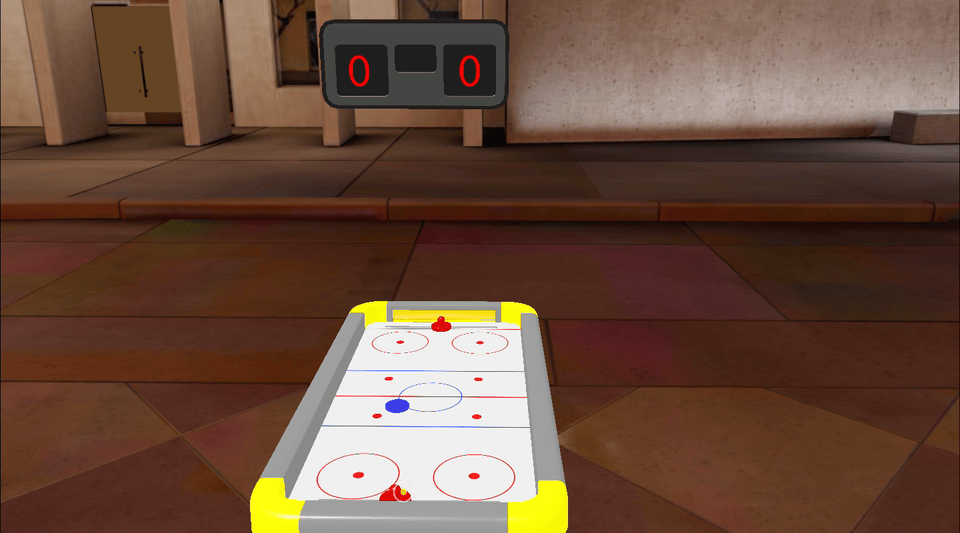

# Connected Air Hockey

This is a sample [Connected Lens](https://developers.snap.com/spectacles/about-spectacles-features/connected-lenses/overview) project that uses [Spectacles Sync Kit](https://developers.snap.com/spectacles/spectacles-frameworks/spectacles-sync-kit/getting-started). 

> __NOTE__: 
> This project will only work for the Spectacles platform. 

## Prerequisites

Lens Studio: v5.4.0+

Spectacles OS Version: v5.59.218+

Spectacles App iOS: v0.59.1.1+

Spectacles App Android: v0.59.1.1+

To update your Spectacles device and mobile app, please refer to this [guide](https://support.spectacles.com/hc/en-us/articles/30214953982740-Updating).

You can download the latest version of Lens Studio from [here](https://ar.snap.com/download?lang=en-US).

## Getting the Project

To obtain the project folder, you need to clone the repository.

> __IMPORTANT__: 
> This project uses Git Large Files Support (LFS). Downloading a zip file using the green button on Github
> **will not work**. You must clone the project with a version of git that has LFS.
> You can download Git LFS here: https://git-lfs.github.com/.

## Initial Project Setup

The project should be pre-configured to get you started without any additional steps. However, if you encounter issues in the Logger Panel, please ensure your Lens Studio environment is set up for [Spectacles](https://developers.snap.com/spectacles/get-started/start-buiding/preview-panel).

## Testing the Lens

### In Lens Studio Editor
Open two Preview panels to test with multiple users in the Connected Lens. Each Preview simluates a user in the multiplayer session. Select the `Start` button to begin playing the game. Each Preview panel takes ownership of a paddle. Move the paddle side to side with your mouse to intercept the puck. The scoreboard updates to reflect goals scored.

### On Spectacles Device
To test Connected Lenses on your device, refer to the guide provided [here](https://developers.snap.com/spectacles/about-spectacles-features/connected-lenses/building-connected-lenses).

After successfully installing the Lens, pinch the `Multiplayer` button to being the Connected Lenses [colocated joining flow](https://developers.snap.com/spectacles/about-spectacles-features/connected-lenses/using-connected-lenses). When the air hockey board appears, pinch the `Start` button to start the game. Pinch a paddle to move it to hit the puck.

## Key Scripts

The following scripts sync the game using Spectacles Sync Kit [sync entities](https://developers.snap.com/spectacles/spectacles-frameworks/spectacles-sync-kit/features/sync-entity) and [storage properties](https://developers.snap.com/spectacles/spectacles-frameworks/spectacles-sync-kit/features/storage-properties).

[AirHockeyPuckTS.ts](./Assets/AirHockey/Typescript/AirHockeyPuckTS.ts) / [AirHockeyPuckJS.js](./Assets/AirHockey/Javascript/AirHockeyPuckJS.js): This script controls the air hockey puck. It handles physics collisions and synced motion of the puck .

[AirHockeyPaddleTS.ts](./Assets/AirHockey/Typescript/AirHockeyPaddleTS.ts) / [AirHockeyPaddleJS.js](./Assets/AirHockey/Javascript/AirHockeyPaddleJS.js): This script controls the paddles. It handles collisions and syncs the position of each player's paddle.

[AirHockeyControllerTS.ts](./Assets/AirHockey/Typescript/AirHockeyControllerTS.ts) / [AirHockeyControllerJS.js](./Assets/AirHockey/Javascript/AirHockeyControllerJS.js): This script controls the game. It handles starting the game, detecting goals, and updating the score.