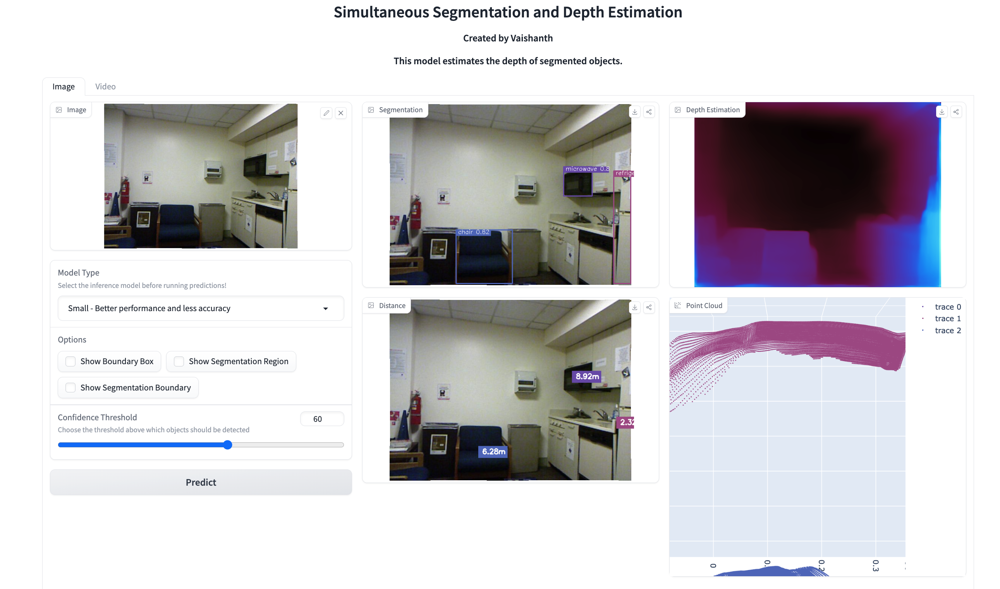
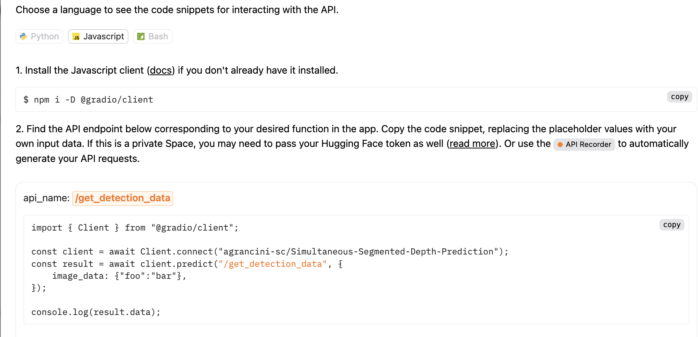
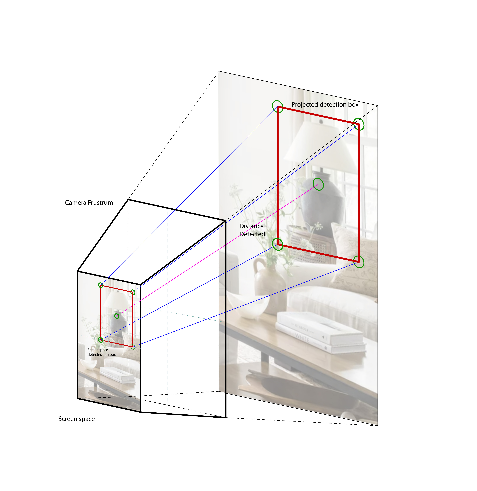
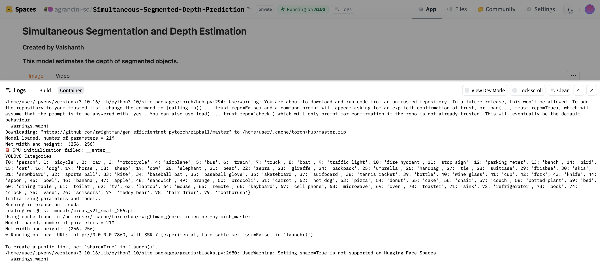
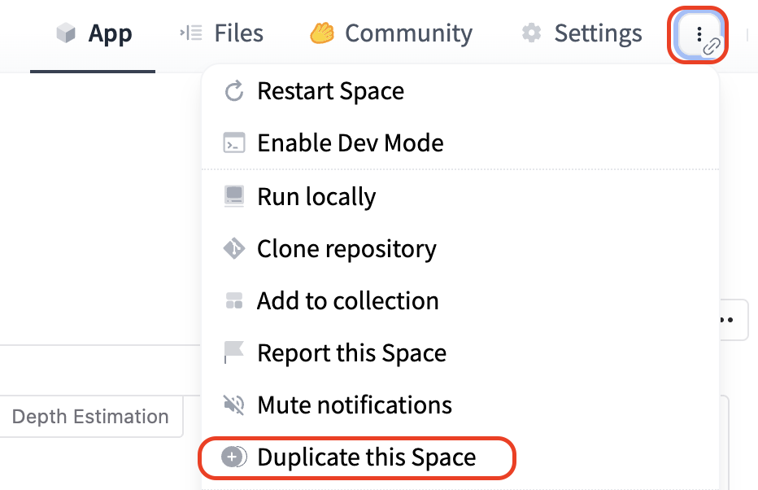
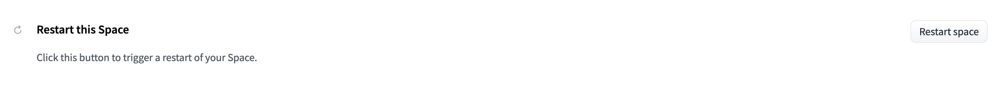
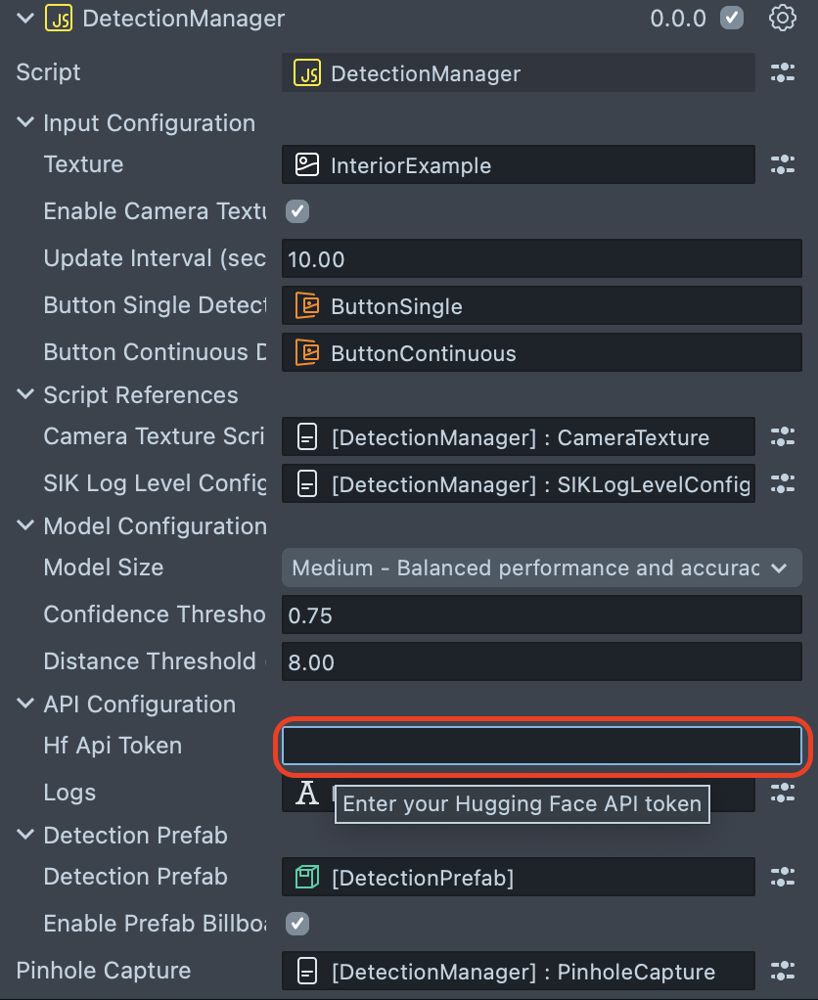
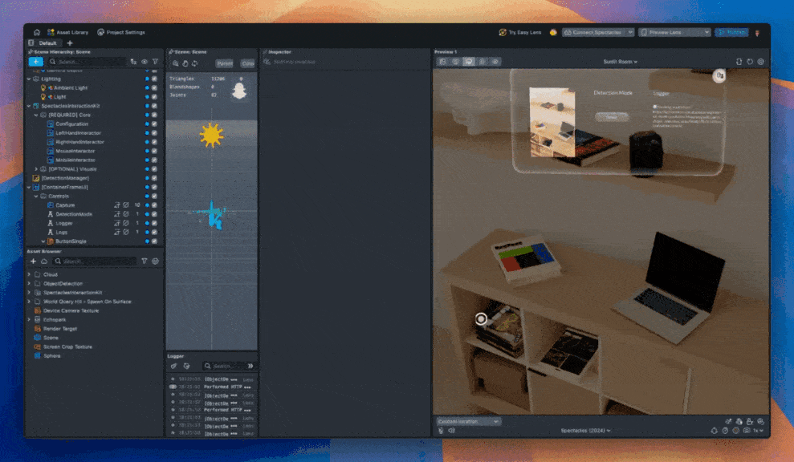

# Remote Object Detection

[](https://developers.snap.com/spectacles/about-spectacles-features/apis/experimental-apis?) [](https://developers.snap.com/spectacles/spectacles-frameworks/spectacles-interaction-kit/features/overview?) [](https://developers.snap.com/spectacles/about-spectacles-features/apis/camera-module?) [](https://developers.snap.com/spectacles/about-spectacles-features/compatability-list) [](https://platform.openai.com/docs/guides/vision?) [](https://developers.snap.com/spectacles/about-spectacles-features/apis/fetch?) [](https://developers.snap.com/spectacles/about-spectacles-features/apis/fetch?) 


> **NOTE:**
> The project is not showcasing SnapML on device capabilities. 
> Stay tuned for more resources regarding on device SnapML applications.
> The project requires the Experimental API checkbox enabled, you won't be able to publish this Lens for now. 
> The project aims to showcase a flexible workflow for you to work with if you are thinking of running models remotely on Spectacles via API.  

## Overview
This is a sample project that demonstrates **Remote Object Detection on Spectacles**. The lens takes advantage of the Hugging Face API. You will need to go through a simple Hugging Face setup for things to work. 
As Object Detection is one of the key aspect of working with Augumented Reality, we created a flexible sample that showcase how to set things up if you would like to take advantage of processing captures on the cloud and return accurate predictions regarding the detections of common objects. 

> **NOTE:**
> This project will only work for the Spectacles platform.
> You must provide your own Hugging Face API key to use the functionality provided by this project.
> **Credit**: The space used in this project is a duplicated version of [Simultaneous Segmentation and Depth Estimation by Vaishanth](https://huggingface.co/spaces/vaishanthr/Simultaneous-Segmented-Depth-Prediction) with an additional custom API-endpoint specific for our use case. 

## Design Guidelines

Designing Lenses for Spectacles offers all-new possibilities to rethink user interaction with digital spaces and the physical world.
Get started using our [Design Guidelines](https://developers.snap.com/spectacles/best-practices/design-for-spectacles/introduction-to-spatial-design)

## Prerequisites

- **Lens Studio**: v5.7.0+
- **Spectacles OS Version**: v5.59.218+
- **Spectacles App iOS**: v0.59.1.1+
- **Spectacles App Android**: v0.59.1.1+

To update your Spectacles device and mobile app, please refer to this [guide](https://support.spectacles.com/hc/en-us/articles/30214953982740-Updating).

You can download the latest version of Lens Studio from [here](https://ar.snap.com/download?lang=en-US).

The camera feature requires you to use Experimental APIs. Please see Experimental APIs for more details [here](https://developers.snap.com/spectacles/about-spectacles-features/apis/experimental-apis).

Extended Permissions mode on device must be enabled for enabling some of the Spectacles APIs. Please see Extended Permissions for more details [here](https://developers.snap.com/spectacles/permission-privacy/extended-permissions).

## Getting Started

To obtain the project folder, clone the repository.

> **IMPORTANT:**
> This project uses Git Large Files Support (LFS). Downloading a zip file using the green button on GitHub **will not work**. You must clone the project with a version of git that has LFS.
> You can download Git LFS [here](https://git-lfs.github.com/).

## Hugging Face

[Hugging Face](https://huggingface.co/) is a free, open-source platform for building, training, and deploying machine learning (ML) models. It's a community for AI experts and enthusiasts that's similar to GitHub for AI. Hugging Face is popular among ML engineers, data scientists, and researchers. It's also used in e-commerce businesses to analyze customer reviews. 

## Simultaneous Segmentation and Depth Estimation



> **NOTE:**
> **Credit**: The space used in this project is a duplicated version of [Simultaneous Segmentation and Depth Estimation by Vaishanth](https://huggingface.co/spaces/vaishanthr/Simultaneous-Segmented-Depth-Prediction) with an additional custom API-endpoint specific for our use case.

This space is a great resource to start with as it provides all the pieces we need to predict objects category and distance. In fact, given a picture or a video, the model is capable of guessing: 

- 2D Bounding Box Segmentaton
- 2D Segmentation regions - similarly to [Segment Anything](https://arxiv.org/abs/2304.02643)
- Deth Mask 
- Object Distance 
- Point Cloud Reconstruction 

The model offer also different model tiers such as 

- Small - Better Performance and less accuracy 
- Medium - Balanced Performance and accuracy 
- Large - Slow Performance and high accuracy 

And Filtering

- Confidence Threshold 

The way we took advantage of all of this was building a new endpoint named **get_detection_data**. 



**get_detection_data** provides the following informations to Lens Studio.

From `app.py`, the main script running the Hugging Face Space.

```python
                detections.append({
                    "class_id": cls_id,
                    "class_name": cls_name,
                    "bounding_box": {"vertices": get_box_vertices([x1, y1, x2, y2])},
                    "center_2d": center, 
                    "distance": float(real_distance),
                    "color": color_rgb,
                    "confidence": float(confidence)
                })
```

## Spatializing predictions with depth estimation



Once obtained all of the detections data from the Hugging Face Space in Lens Studio we spatialize the output from screen space to world space using Spectacles-specifics transformations. 

From `DetectionManager.js`, the main script receiving **get_detection_data** and transforming the visualization in Lens Studio or Spectacles space. 

```javascript
     if (global.deviceInfoSystem.isEditor()) {
      newCenter = CameraService.getInstance()
        .getCamera(0)
        .screenSpaceToWorldSpace(normalizedCenter, detection.distance); //* 100);
    } else {
      newCenter = script.pinholeCapture.captureToWorld(
        normalizedCenter,
        detection.distance * 25
      );
      newCenter = new vec3(newCenter.x, newCenter.y - 50, newCenter.z);
    }
```

## Initial Project Setup

The project should be pre-configured to get you started without any additional steps beside the Hugging Face setup. 

1. If you are not a Hugging Face user, please sign up on [Hugging Face](https://huggingface.co/). 
2. Go on this Space [Simultaneous Segmentation and Depth Estimation](https://huggingface.co/spaces/agrancini-sc/
Simultaneous-Segmented-Depth-Prediction?logs=build) we previously set up for this project. 




3. Duplicate the Space. This will create an exact copy of this Space on your account.



4. Go in the settings of the space and set up your space. You will be able to choose across multiple options like 

- Space Hardware
- Sleep Time Settings
- Persistent Storage 
- Dev Mode 
- Space Visibility 
- etc. 

Get familiar with the concept of Space [here](https://huggingface.co/docs/hub/en/spaces-overview).

Then restart your space. 




5. In Lens Studio, in the `DetectionManager.js`script add your Hugging Face API Token.

See [here](https://huggingface.co/docs/hub/en/security-tokens) how to get access with User Access Token. 
This token will allow you to ping your endpoint from Lens Studio using the [Fetch API](https://developers.snap.com/spectacles/about-spectacles-features/apis/internet-access).




Failure to set your Hugging Face API key will result in errors when using the lens. The feature should work both in the editor and on the device.

**Remember to update your URLs** in `DetectionManager.js` as well with the ones from you personal Hugging Face Space. 

```javascript
const apiUrl =
    "https://agrancini-sc-simultaneous-segmented-depth-prediction.hf.space/gradio_api/call/get_detection_data";
```
## Key Features

### Depth Estimated Placement 

The lens uses the depth estimated model to place objects on respective objects. 
The YOLOv8 model that runs on the server is capable of identifying the following objects, and these can be filtered.

```javascript
YOLOv8 Categories:
{0: 'person', 1: 'bicycle', 2: 'car', 3: 'motorcycle', 4: 'airplane', 5: 'bus', 6: 'train', 7: 'truck', 8: 'boat', 9: 'traffic light', 10: 'fire hydrant', 11: 'stop sign', 12: 'parking meter', 13: 'bench', 14: 'bird', 15: 'cat', 16: 'dog', 17: 'horse', 18: 'sheep', 19: 'cow', 20: 'elephant', 21: 'bear', 22: 'zebra', 23: 'giraffe', 24: 'backpack', 25: 'umbrella', 26: 'handbag', 27: 'tie', 28: 'suitcase', 29: 'frisbee', 30: 'skis', 31: 'snowboard', 32: 'sports ball', 33: 'kite', 34: 'baseball bat', 35: 'baseball glove', 36: 'skateboard', 37: 'surfboard', 38: 'tennis racket', 39: 'bottle', 40: 'wine glass', 41: 'cup', 42: 'fork', 43: 'knife', 44: 'spoon', 45: 'bowl', 46: 'banana', 47: 'apple', 48: 'sandwich', 49: 'orange', 50: 'broccoli', 51: 'carrot', 52: 'hot dog', 53: 'pizza', 54: 'donut', 55: 'cake', 56: 'chair', 57: 'couch', 58: 'potted plant', 59: 'bed', 60: 'dining table', 61: 'toilet', 62: 'tv', 63: 'laptop', 64: 'mouse', 65: 'remote', 66: 'keyboard', 67: 'cell phone', 68: 'microwave', 69: 'oven', 70: 'toaster', 71: 'sink', 72: 'refrigerator', 73: 'book', 74: 'clock', 75: 'vase', 76: 'scissors', 77: 'teddy bear', 78: 'hair drier', 79: 'toothbrush'}
```

The scripts responsible for the transformation are the `PinholeCameraModel.ts` and `PinholeCapture.ts`

```typescript
  worldToCapture(worldPos: vec3): vec2 {
    const worldToView = this.mainCamera
      .getTransform()
      .getInvertedWorldTransform();
    const viewPos = worldToView.multiplyPoint(worldPos);
    const capturePos = this.cameraDevice.pose.multiplyPoint(viewPos);
    const captureUV = this.cameraModel.projectToUV(capturePos);
    return captureUV;
  }

  captureToWorld(captureUV: vec2, depth: number): vec3 {
    const viewToWorld = this.mainCamera.getTransform().getWorldTransform();
    const capturePos = this.cameraModel.unprojectFromUV(captureUV, depth);
    const viewPos = this.cameraDevice.pose.inverse().multiplyPoint(capturePos);
    const worldPos = viewToWorld.multiplyPoint(viewPos);
    return worldPos;
  }
```

### Encode and Send Camera Captures via Fetch API

Leveraging [Snap Camera API](https://developers.snap.com/spectacles/about-spectacles-features/apis/camera-module). This feature is handled by the `DetectionManager.js` script.

```javascript
function encode(texture) {
  return new Promise(function (resolve, reject) {
    Base64.encodeTextureAsync(
      texture,
      function (encoded) {
        debugLog("✅ Encoded length: " + encoded.length);
        resolve(encoded);
      },
      function (error) {
        reject(error);
      },
      CompressionQuality.LowQuality,
      EncodingType.Png
    );
  });
}
```

### Tweak Model Properties in Lens Studio 

You can change some properties in `DetectionManager.js` script directly in Lens Studio:

- Model Size (Recommended small or medium)
- Confidence Threshold as a 0-1 parameter (Recommended above 0.8). 
- Distance Threshold (Recommended below 10 meters)


## Key Scripts

### CameraTexture.js

This script handles:

- Capturing input from the camera via the Spectacles Camera API.
- Sending the captured visual data to `DetectionManager.js`.
- Providing feedback image capture on the user's spatial UI.

### DetectionManager.js

This script handles:

- Encoding and sending the capture to the HuggingFace API
- Returning the processed data from the HuggingFace API
- Visualizing spatially the detections 

### PinholeCapture.js

This script handles:

- Converting screen space coordinates to world space based on the Spectacles camera Frustrum

## Limitations 

## Testing the Lens

### In Lens Studio Editor

1. Open the Preview panel in Lens Studio.
2. Ensure your Hugging Face API key is correctly set in the DetectionManager script.
3. Run the server and test the detection in the different interactive previews. Distance will be finally accurate on device. 



### On Spectacles Device

1. Build and deploy the project to your Spectacles device.
2. Follow the [Spectacles guide](https://developers.snap.com/spectacles/get-started/start-building/preview-panel) for device testing.
3. Interact with the detect button to experience remote object detection tool in action.

## Hugging Face Usage Disclaimer

Ensure that you comply with Hugging Face’s API usage policies and Spectacles terms of service when deploying and testing this project.

## Support

If you have any questions or need assistance, please don't hesitate to reach out. Our community is here to help, and you can connect with us and ask for support [here](https://www.reddit.com/r/Spectacles/). We look forward to hearing from you and are excited to assist you on your journey!

## Contributing

Feel free to provide improvements or suggestions or directly contributing via merge request. By sharing insights, you help everyone else build better Lenses.