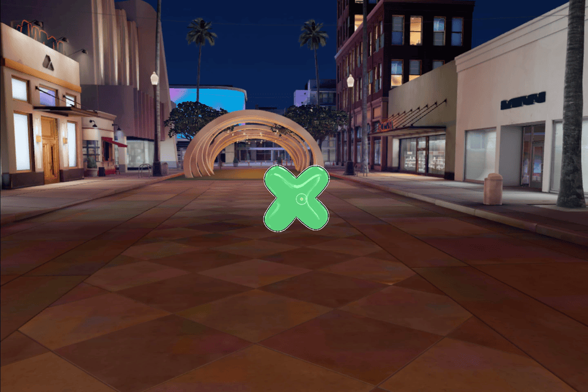

# Connected Tic Tac Toe

This is a sample [Connected Lens](https://developers.snap.com/spectacles/about-spectacles-features/connected-lenses/overview) project that uses [Spectacles Sync Kit](https://developers.snap.com/spectacles/spectacles-frameworks/spectacles-sync-kit/getting-started). 

> __NOTE__: 
> This project will only work for the Spectacles platform. 

## Prerequisites

Lens Studio: v5.4.0+

Spectacles OS Version: v5.59.218+

Spectacles App iOS: v0.59.1.1+

Spectacles App Android: v0.59.1.1+

To update your Spectacles device and mobile app, please refer to this [guide](https://support.spectacles.com/hc/en-us/articles/30214953982740-Updating).

You can download the latest version of Lens Studio from [here](https://ar.snap.com/download?lang=en-US).

## Getting the Project

To obtain the project folder, you need to clone the repository.

> __IMPORTANT__: 
> This project uses Git Large Files Support (LFS). Downloading a zip file using the green button on Github
> **will not work**. You must clone the project with a version of git that has LFS.
> You can download Git LFS here: https://git-lfs.github.com/.

## Initial Project Setup

The project should be pre-configured to get you started without any additional steps. However, if you encounter issues in the Logger Panel, please ensure your Lens Studio environment is set up for [Spectacles](https://developers.snap.com/spectacles/get-started/start-buiding/preview-panel).

## Testing the Lens

### In Lens Studio Editor
Open two Preview panels to test with multiple users in the Connected Lens. Each Preview simluates a user in the multiplayer session. X and O objects will spawn for each user when it is their turn. Use your mouse to move and arrange the objects to play a game of Tic Tac Toe.

### On Spectacles Device
To test Connected Lenses on your device, refer to the guide provided [here](https://developers.snap.com/spectacles/about-spectacles-features/connected-lenses/building-connected-lenses).

After successfully installing the Lens, pinch the Multiplayer button to being the Connected Lenses [colocated joining flow](https://developers.snap.com/spectacles/about-spectacles-features/connected-lenses/using-connected-lenses). Once two users have joined, the game begins by spawning an X for the first player. 

## Key Scripts

The following scripts sync the game using Spectacles Sync Kit features, including [sync entities](https://developers.snap.com/spectacles/spectacles-frameworks/spectacles-sync-kit/features/sync-entity), [storage properties](https://developers.snap.com/spectacles/spectacles-frameworks/spectacles-sync-kit/features/storage-properties), [networked events](https://developers.snap.com/spectacles/spectacles-frameworks/spectacles-sync-kit/features/networked-events), and the [Instantiator](https://developers.snap.com/spectacles/spectacles-frameworks/spectacles-sync-kit/features/instantiator) to instantiate prefabs.

[ContollerTS.ts](./Assets/TicTacToe/Typescript/ControllerTS.ts) / [ControllerJS.js]((./Assets/TicTacToe/Javascript/ControllerJS.js)): This script controls assigning player roles and spawning X and O objects using the Instantiator component.

[PieceTS.ts](./Assets/TicTacToe/Typescript/PieceTS.ts) / [PieceJS.js]((./Assets/TicTacToe/Javascript/PieceJS.js)): This script is attached to each prefab. It enables manipulation for the player whose turn it is.